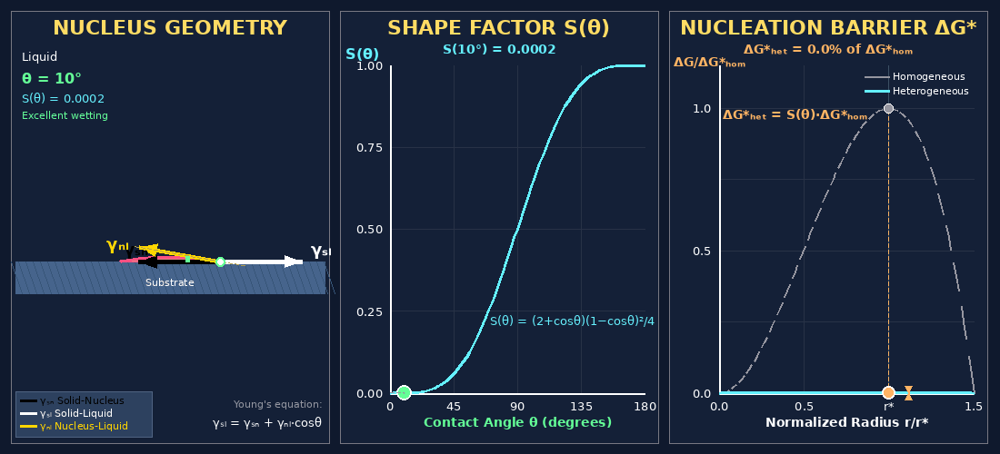

# Heterogeneous Nucleation Visualization

Interactive visualization demonstrating how contact angle affects heterogeneous nucleation barriers in materials science.



## 🔬 Live Demo

[](https://molab.marimo.io/notebooks/nb_LxW3K2SjDn9j5uFzXRQ8gm)

Use the slider to adjust the contact angle and see how it affects:
- Nucleus geometry (spherical cap shape)
- Shape factor $S(\theta)$
- Nucleation energy barrier $\Delta G^\ast$

## Physics Background

### Heterogeneous vs Homogeneous Nucleation

Nucleation is the first step in phase transformations (e.g., solidification, precipitation). Homogeneous nucleation occurs uniformly throughout a material, while heterogeneous nucleation occurs at preferential sites like surfaces, grain boundaries, or impurities.

Heterogeneous nucleation is favored because it requires less energy — the nucleus forms as a spherical cap rather than a full sphere, reducing the total surface energy.

### The Shape Factor $S(\theta)$

The key relationship is governed by the shape factor:

$$S(\theta) = \frac{(2 + \cos\theta)(1 - \cos\theta)^2}{4}$$

This determines how much the nucleation barrier is reduced:

$$\Delta G^\ast_{het} = S(\theta) \cdot \Delta G^\ast_{hom}$$

| Contact Angle | $S(\theta)$ | Barrier Reduction | Wetting |
|:-------------:|:-----------:|:-----------------:|:-------:|
| $\theta \to 0°$ | $\to 0$ | Nearly eliminated | Excellent |
| $\theta = 60°$ | 0.16 | 84% reduction | Good |
| $\theta = 90°$ | 0.50 | 50% reduction | Moderate |
| $\theta = 120°$ | 0.84 | 16% reduction | Poor |
| $\theta \to 180°$ | $\to 1$ | No reduction | Non-wetting |

### Surface Tension Balance (Young's Equation)

At the triple point where nucleus, liquid, and substrate meet, the surface tensions are in equilibrium:

$$\gamma_{SL} = \gamma_{SN} + \gamma_{NL} \cos\theta$$

Where:
- $\gamma_{SL}$ = Substrate–Liquid interfacial energy
- $\gamma_{SN}$ = Substrate–Nucleus interfacial energy
- $\gamma_{NL}$ = Nucleus–Liquid interfacial energy

### Visualization Panels

1. **Nucleus Geometry (Left):** Shows the spherical cap nucleus on the substrate with surface tension vectors and contact angle. The dashed circle shows the full sphere that the cap belongs to, with radius $r$.

2. **Shape Factor $S(\theta)$ (Middle):** Plots the shape factor vs contact angle, showing how the barrier reduction factor varies from 0 to 1.

3. **Nucleation Barrier $\Delta G^\ast$ (Right):** Compares the energy barrier curves for homogeneous (dashed) and heterogeneous (solid) nucleation. Both peak at the critical radius $r^\ast$, but the heterogeneous barrier is lower by factor $S(\theta)$.

## Running Locally

```bash
pip install marimo pillow
marimo run app.py
```

Or generate the GIF:

```bash
pip install pillow
python generate_v2.py
```

## Files

| File | Description |
|------|-------------|
| `app.py` | Marimo notebook source code |
| `generate_v2.py` | GIF generation script |
| `heterogeneous_nucleation.gif` | Animated visualization |
| `requirements.txt` | Python dependencies |

## References

- Porter, D.A. & Easterling, K.E., *Phase Transformations in Metals and Alloys*
- Callister, W.D., *Materials Science and Engineering: An Introduction*

## License

MIT
