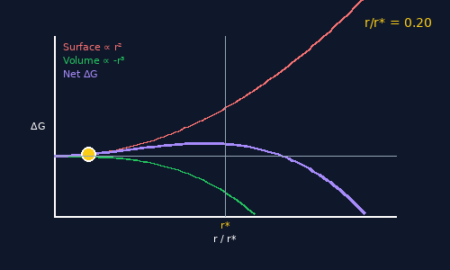
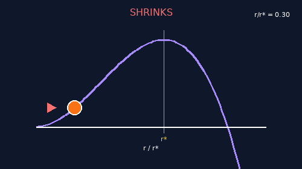
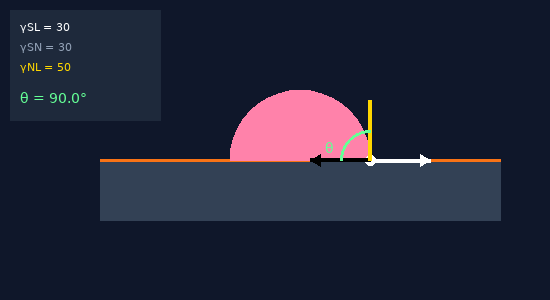
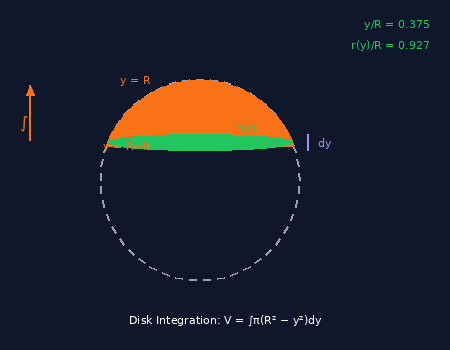
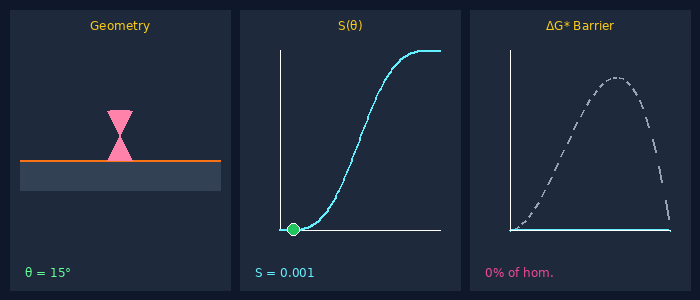

# Heterogeneous Nucleation

Interactive visualization of how surfaces catalyze phase transformations.

[](https://molab.marimo.io/notebooks/nb_LxW3K2SjDn9j5uFzXRQ8gm)

## Overview

| Part | Content |
|------|---------|
| **Part 1** | Why nucleation has a barrier, why surfaces help |
| **Part 2** | Step-by-step derivation of the shape factor |
| **Part 3** | Interactive 3-panel visualization |

## Interactive Visualizations

### Energy Competition


Surface energy (∝ r²) vs volume energy (∝ r³) — drag the slider to see the critical radius r*.

### Nucleus Fate


Watch a nucleus grow or shrink based on its size relative to r*.

### Surface Tension Balance


Adjust γ<sub>SL</sub>, γ<sub>SN</sub>, γ<sub>NL</sub> to see Young's equation determine θ.

### Disk Integration


Visualize the calculus: move a disk slice through the spherical cap.

### Complete 3-Panel Dashboard


Geometry, shape factor S(θ), and barrier reduction — all responding to contact angle.

## The Derivation

**Step 1: Geometry**
$$h = R(1 - \cos\theta), \quad a = R\sin\theta$$

**Step 2: Cap Volume** (disk integration)
$$V_{cap} = \int_{R-h}^{R} \pi(R^2 - y^2) \, dy = \frac{\pi h^2}{3}(3R - h)$$

**Step 3: Shape Factor**
$$S(\theta) = \frac{(2 + \cos\theta)(1 - \cos\theta)^2}{4}$$

**Step 4: Barrier Reduction**
$$\Delta G^*_{het} = S(\theta) \cdot \Delta G^*_{hom}$$

## Key Equations

### Shape Factor S(θ)

| θ | S(θ) | Barrier |
|:---:|:---:|:---:|
| 0° | 0 | Eliminated |
| 90° | 0.50 | 50% |
| 180° | 1 | No reduction |

### Young's Equation

$$\gamma_{SL} = \gamma_{SN} + \gamma_{NL} \cos\theta$$

## Running Locally

```bash
pip install marimo pillow matplotlib numpy
marimo run app.py
```

## License

MIT
